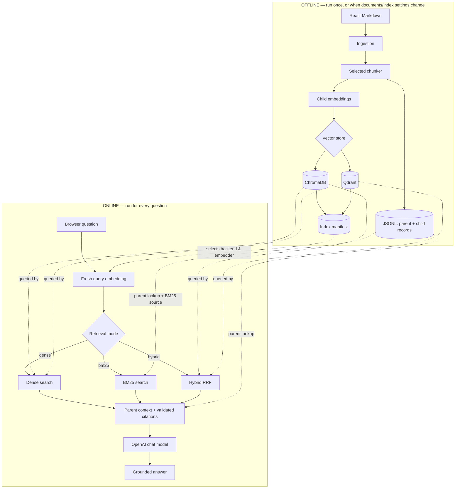

# React documentation RAG: low-level design

## Architecture

## Implemented components

| Component | Responsibility |
| --- | --- |
| `chunker.py` | Markdown-aware, fixed-overlap, and recursive parent/child chunking. |
| `indexing/pipeline.py` | Explicit offline ingestion, chunking, embedding, vector-store upsert, and manifest creation. |
| `embed/` | Local and OpenAI embedding providers plus the document embedding cache. |
| `indexing/vector_store.py` | Shared `VectorStore` interface (`upsert_chunks`, `query_dense`, `query_hybrid`, `close`). |
| `indexing/chroma_store.py` | Persistent ChromaDB child storage and dense queries; hybrid is fused separately in `search/engine.py`. |
| `indexing/qdrant_store.py` | Local embedded Qdrant child storage with dense + sparse vectors and *native* RRF hybrid search. |
| `search/` | Fresh query embedding, BM25, dense retrieval, and RRF hybrid fusion (manual for Chroma, delegated to Qdrant when active). |
| `rag/service.py` | Manifest-aware online orchestration (reads `vectorDb`/`embedder` to pick the matching backend), metadata filters, parent hydration, citations, and structured results. |
| `generation/` | Provider contract and grounded OpenAI chat generation. |
| `ui/` | Local browser server with offline setup (incl. vector-database choice) and online query panels. |

## Offline and online boundaries

Chunking method, target size, maximum size, overlap, document embedding model, and
vector-database backend are offline settings. Changing one requires rebuilding JSONL
and the vector index. The manifest records the selected values.

Question text, Top K, search method, and answer-generation toggle are online settings.
Each dense or hybrid question receives a new query embedding compatible with the
stored document vectors. BM25 queries do not need embeddings.

Document type, content kind, and exact route are optional online filters. They are
applied consistently to dense and BM25 candidates before hybrid fusion. Each offline
build writes a new collection, then activates it through the manifest so stale chunks
from an earlier strategy are never queried.

## Current constraints

This is a local learning application. ChromaDB and Qdrant (embedded, local-only) are
the two supported vector stores; BM25 is rebuilt in memory; OpenAI is the only answer
generator; and there is no authentication, model reranker, multi-process build lock,
atomic staging index, or production server. Retrieved source content and user input
are treated as data and never executed.
